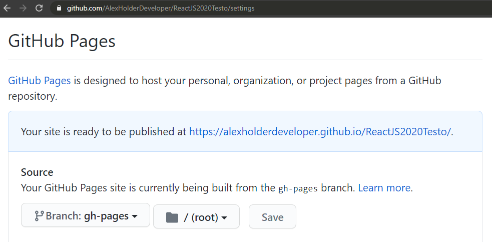

# ReactJS 2020 Testo

Dummy app to see any changes in WSL ReactJS development after moving to WSL2 and coming back to ReactJS after ~7 months of not touching it.

## My Steps

1. Created a git repo using Github Desktop, with the repo name in all lowercase.
2. Opened the repo in VS Code.
3. Logged into root in the VS Code terminal.
4. Ran the command `npx create-react-app .` in the terminal. This is distinct from `npx create-react-app my-app-name`, as using "." as the name creates the app in the current directory. ReactJS apps require their directory to have no uppercase characters in their name, hence the mention of lowercase in step 1.
5. Ran the command `export PATH=$PATH:/mnt/c/Windows/System32` in the VS Code terminal. This is a WSL-specific step. Ideally, you should add this command to a specific Ubuntu file so that this command runs automatically when you open the terminal, but I can never remember what the file is & prefer the reassurance that running the command manually provides.
   1. Basically, WSL does not support all Ubuntu/Linux things. ReactJS relies on some of those unsupported things to run. Clarifying the PATH variable via the command above makes those unsupported things work properly.
   2. I was sure this was supposed to be fixed in newer ReactJS versions or in WSL2, but maybe this is an issue with my WSL1->WSL2 upgrade. Next computer format will start with WSL2 straight away instead of WSL1 to see if that makes a difference.
6. Ran the command `npm start` to run the development version of the ReactJS app.
7. Changed the message in `src/App.js` as per the ReactJS boilerplate instructions.
   1. Note: WSL2 does NOT support the auto-recompile & reload that ReactJS enjoys on other platforms & dev environments. To get around this, maybe try making a ReactJS project inside the WSL2 Linux file system instead of the Windows file system? Unconfirmed.
8. Ran the command `npm run build` to build a production version of the ReactJS app.
9. Ran the command `npm test` to see what ReactJS' testing suite is like. It's wicked. Good default behaviour.
10. Created a Github Actions workflow file to automate building & deployment of the ReactJS app to a Github Pages website.
11. Added the `homepage` property to the project's `package.json` file, using the repository name as the homepage value. For this repo, the key & value is: ` "homepage": "/ReactJS2020Testo"`. The repo name has capital letters due to a mix-up when making the repo before making the ReactJS app. The deployed URL for this website follows the syntax of `githubUsername.github.io/repositoryName`, meaning this website is deployed at `alexholderdeveloper.github.io/ReactJS2020Testo`.
12. Committed & pushed app to local & remote repo.
13. Went into the Github repository settings and enabled Github Pages for the repository. 
14. Pointed the Github Pages settings to use the files from the branch named `gh-pages` that is made & updated with the Github Actions workflow file. Settings should look like below:

This project was bootstrapped with [Create React App](https://github.com/facebook/create-react-app).

## Available Scripts

In the project directory, you can run:

### `yarn start`

Runs the app in the development mode. 
Open [http://localhost:3000](http://localhost:3000) to view it in the browser.

The page will reload if you make edits. 
You will also see any lint errors in the console.

### `yarn test`

Launches the test runner in the interactive watch mode. 
See the section about [running tests](https://facebook.github.io/create-react-app/docs/running-tests) for more information.

### `yarn build`

Builds the app for production to the `build` folder. 
It correctly bundles React in production mode and optimizes the build for the best performance.

The build is minified and the filenames include the hashes. 
Your app is ready to be deployed!

See the section about [deployment](https://facebook.github.io/create-react-app/docs/deployment) for more information.

### `yarn eject`

**Note: this is a one-way operation. Once you `eject`, you can’t go back!**

If you aren’t satisfied with the build tool and configuration choices, you can `eject` at any time. This command will remove the single build dependency from your project.

Instead, it will copy all the configuration files and the transitive dependencies (webpack, Babel, ESLint, etc) right into your project so you have full control over them. All of the commands except `eject` will still work, but they will point to the copied scripts so you can tweak them. At this point you’re on your own.

You don’t have to ever use `eject`. The curated feature set is suitable for small and middle deployments, and you shouldn’t feel obligated to use this feature. However we understand that this tool wouldn’t be useful if you couldn’t customize it when you are ready for it.

## Learn More

You can learn more in the [Create React App documentation](https://facebook.github.io/create-react-app/docs/getting-started).

To learn React, check out the [React documentation](https://reactjs.org/).

### Code Splitting

This section has moved here: https://facebook.github.io/create-react-app/docs/code-splitting

### Analyzing the Bundle Size

This section has moved here: https://facebook.github.io/create-react-app/docs/analyzing-the-bundle-size

### Making a Progressive Web App

This section has moved here: https://facebook.github.io/create-react-app/docs/making-a-progressive-web-app

### Advanced Configuration

This section has moved here: https://facebook.github.io/create-react-app/docs/advanced-configuration

### Deployment

This section has moved here: https://facebook.github.io/create-react-app/docs/deployment

### `yarn build` fails to minify

This section has moved here: https://facebook.github.io/create-react-app/docs/troubleshooting#npm-run-build-fails-to-minify
